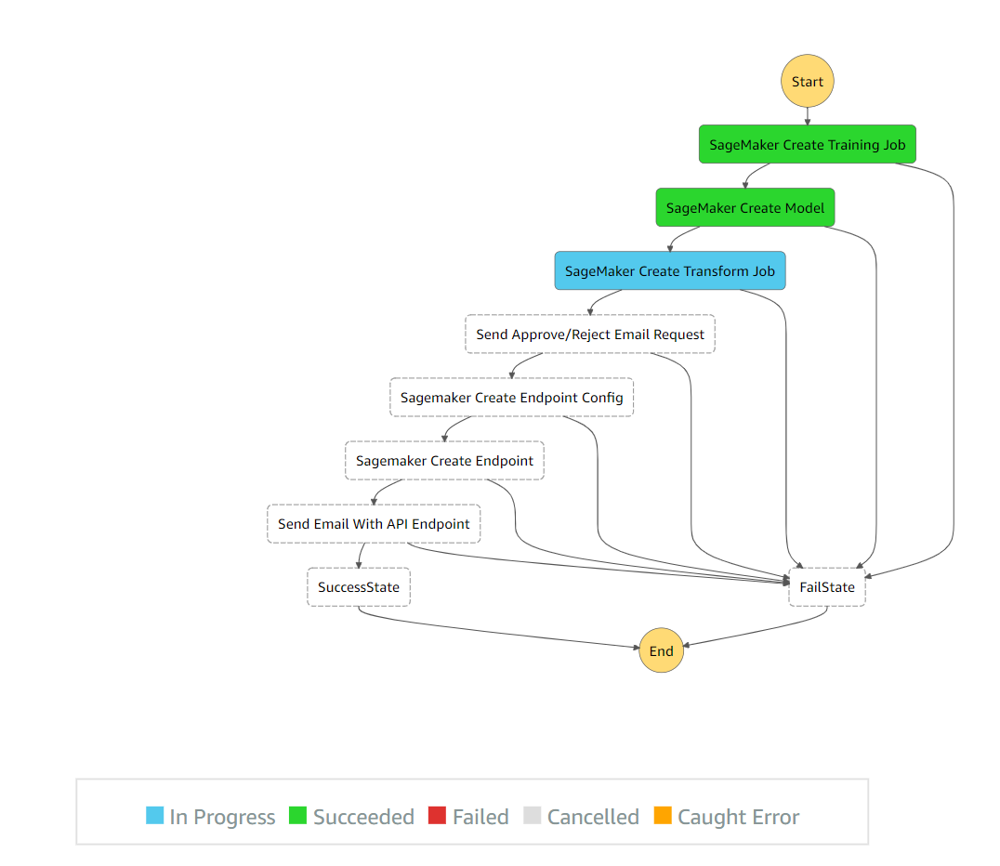
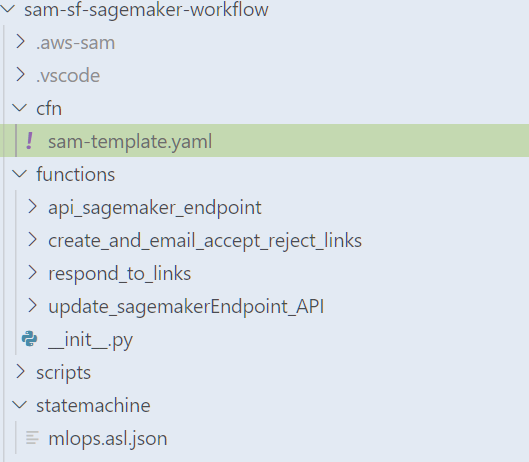
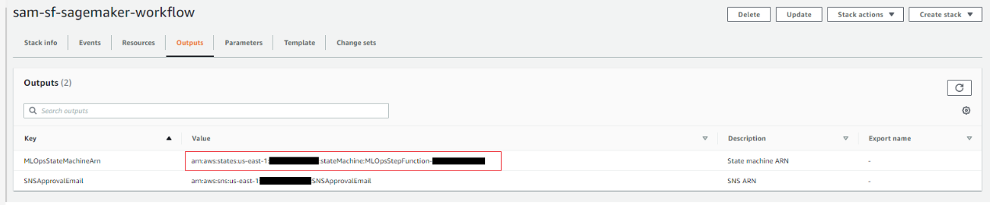

# CI/CD Pipeline for deploying custom Sagemaker ML models using AWS SAM and Step Functions
Automating the build and deployment of machine learning models is an important step in creating production ready machine learning services. Models need to be retrained and deployed when code and/or data are updated. This project provides an overview on use of Step Functions native service integrations with Sagemaker to train, deploy ML models, test results, and finally expose an inference endpoint using API Gateway and Lambda function. This Step Function also provides a way to wait for human approval, before the state transitions can progress towards final ML Model Inference endpoints configurations and deployment.

## Architecture

#### The following diagram describes the flow of the Step Function StateMachine. There are several points where the StateMachine has to poll and wait for a task to complete.
Code for creating and operating ML Ops pipeline is divided into <b>2 Github Repositories</b>, this is the first part repository, which focuses on building, and deploying Step Functions workflow with native service integrations with Sagemaker, and waiting for human approval, to proceed towards creating Sagemaker Endpoint Inference.




## Prerequisites

- Set up an AWS account. ([instructions](https://AWS.amazon.com/free/?sc_channel=PS&sc_campaign=acquisition_US&sc_publisher=google&sc_medium=cloud_computing_b&sc_content=AWS_account_bmm_control_q32016&sc_detail=%2BAWS%20%2Baccount&sc_category=cloud_computing&sc_segment=102882724242&sc_matchtype=b&sc_country=US&s_kwcid=AL!4422!3!102882724242!b!!g!!%2BAWS%20%2Baccount&ef_id=WS3s1AAAAJur-Oj2:20170825145941:s))
- Configure AWS CLI and a local credentials file. ([instructions](http://docs.AWS.amazon.com/cli/latest/userguide/cli-chap-welcome.html))
- Install AWS SAM (Serverless Application Model). ([instructions](https://docs.aws.amazon.com/serverless-application-model/latest/developerguide/serverless-sam-cli-install.html))
- Download Visual Studio Code ([instructions](https://code.visualstudio.com/))
- Download AWS Toolkit for VS Code. ([instructions](https://aws.amazon.com/visualstudiocode/))
- Clone this repo.  
``` 
   git clone https://github.com/aws-samples/sam-sf-sagemaker-workflow.git
```

## Setup
1. Open VS Code, and open the folder where repo was cloned. Folder structure should look like shown below



2. To run the SAM template, execute the script provided below from the root folder. Ensure that you upload your training dataset to the S3 bucket. Assign name of that S3 bucket to variable S3_BUCKET_MODEL as shown in code below. If you want to follow the example provided in this [blog](https://aws.amazon.com/blogs/machine-learning/build-a-ci-cd-pipeline-for-deploying-custom-machine-learning-models-using-aws-services/), you will need to upload the iris.csv dataset to S3 model bucket, which can be found [here](https://github.com/aws/amazon-sagemaker-examples/blob/main/advanced_functionality/scikit_bring_your_own/data/iris.csv).
```
S3_BUCKET=bucket-mlops #bucket to store SAM template [Make sure you have created this S3 bucket manually.]
S3_BUCKET_MODEL=ml-models   #bucket to store ML models [Make sure you have created this S3 bucket manually and uploaded necessary training dataset. 
STACK_NAME=sam-sf-sagemaker-workflow   #Name of the SAM stack
sam build  -t cfn/sam-template.yaml --use-container   #SAM build 
sam deploy --template-file .aws-sam/build/template.yaml \
--stack-name ${STACK_NAME} --force-upload \
--s3-bucket ${S3_BUCKET} --s3-prefix sam \
--parameter-overrides S3ModelBucket=${S3_BUCKET_MODEL} \
--capabilities CAPABILITY_IAM
```

3. AS seen above, <b> sam build </b>, builds all the functions, also creates the final packaged cloudformation with provided S3 bucket to store the generated artifacts. Then <b> sam deploy </b>, then uploads the necessary files to the s3 bucket, and starts creating / updating cloudformation template to create the necessary AWS infrastructure.

4. Once template has been successfully executed, login in to your AWS Account, and go to Cloudformation, find the stack-name [STACK_NAME], and go to outputs tab, copy the MLOpsStateMachineArn value and keep in a notepad for later use in the second phase.



5. Now we will build the CI/CD Pipeline for deploying Custom Machine Learning Docker Images, and then kick of the Step Function workflow we just created.Please click [here] (https://github.com/aws-samples/codepipeline-ecr-build-sf-execution) to get started.
